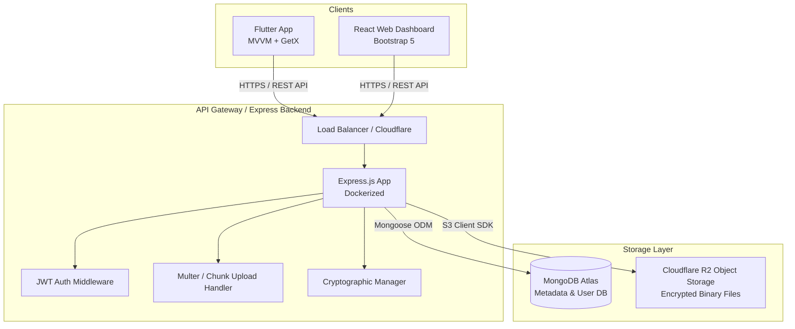
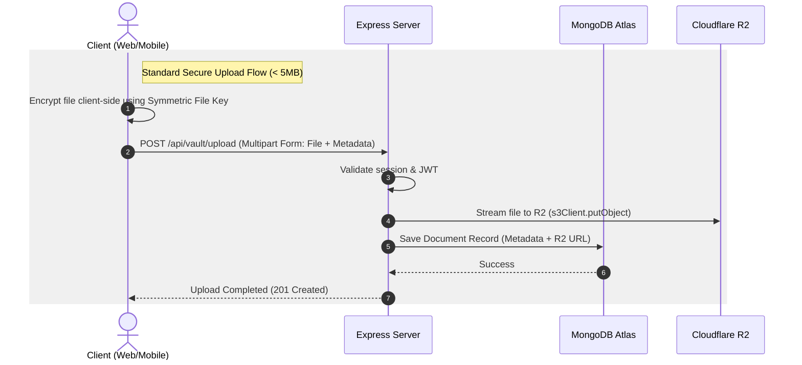
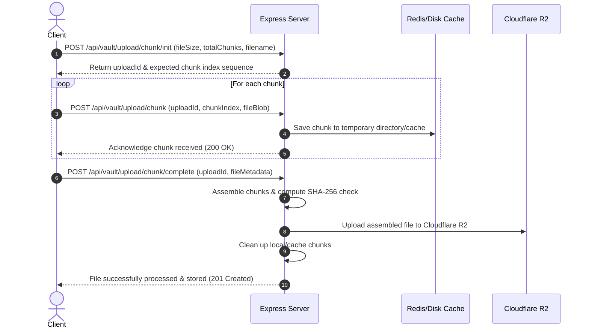
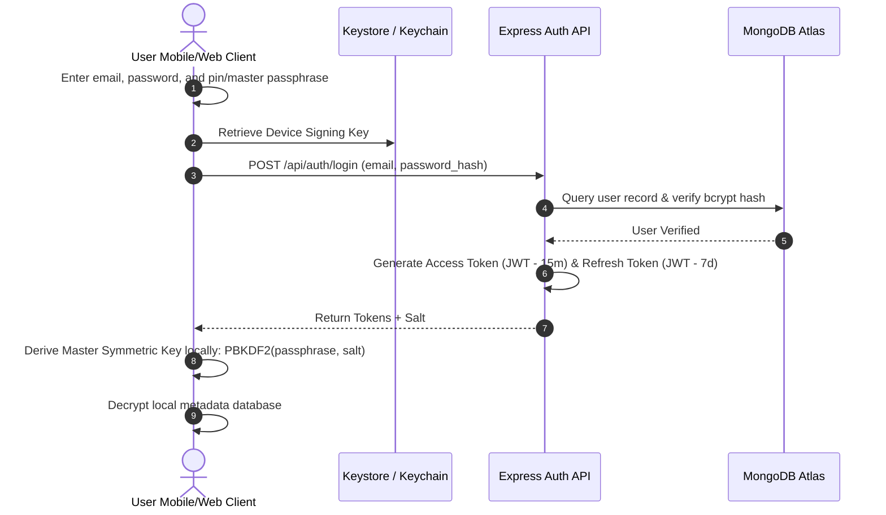
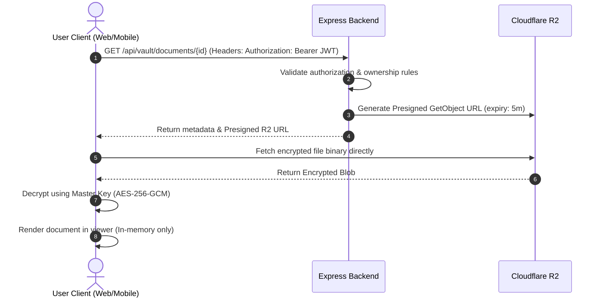
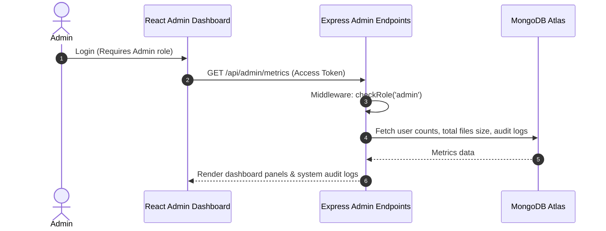

# Software Architecture & Flow Design - Personal Vault

## 1. High-Level System Architecture

Personal Vault uses a modern, multi-tier, decoupled architecture designed to support multiple clients (Flutter Mobile and React Web) communicating over a unified RESTful API, backed by a Node.js/Express service, MongoDB Atlas for metadata, and Cloudflare R2 for binary storage.



### 1.1 Client Tier
* **Flutter Mobile App (iOS & Android):** Implements an **MVVM (Model-View-ViewModel)** architecture using **GetX** for reactive state management, routing, and dependency injection. It handles local biometric validation, password derivation using PBKDF2, and client-side encryption/decryption.
* **React Web App:** A responsive administrative dashboard utilizing **Bootstrap 5**. It interacts with the same REST APIs and manages user sessions via secure JWT tokens, handling chunk uploads and file decryption on the desktop.

### 1.2 Backend Tier (Node.js & Express)
* **Application Gateway:** Deployed inside a Docker container on Render, Railway, or Fly.io behind Cloudflare proxying.
* **Controller-Service-Repository Pattern:** Decouples route handlers (controllers), business logic (services), and data access (repositories/Mongoose models).
* **Chunk Upload Middleware:** Custom Express middleware built on top of Multer to assemble, validate, and merge chunked file uploads before storing them in Cloudflare R2.

### 1.3 Storage & CDN Tier
* **MongoDB Atlas:** Managed multi-region replica sets storing structured metadata, user preferences, audited logs, and client-side encrypted credentials (cards, notes).
* **Cloudflare R2 Storage:** S3-compatible, zero-egress fee object storage. Used to store all document files, encrypted using AES-256-GCM.

---

## 2. Storage Strategy & Architecture

Cloudflare R2 is chosen as the central storage repository due to its zero egress fees and high performance.



### 2.1 Bucket Layout & Organization
To ensure strict security boundaries, objects are organized using a user-scoped prefix path pattern:

```text
r2-personal-vault-bucket/
└── users/
    └── {user_uuid}/
        ├── identity_documents/
        │   ├── {document_uuid}_enc.bin
        │   └── {document_uuid}_thumbnail.bin
        ├── medical_records/
        │   └── {record_uuid}_enc.bin
        ├── certificates/
        │   └── {certificate_uuid}_enc.bin
        └── general_files/
            └── {file_uuid}_enc.bin
```

### 2.2 Access Control and Delivery
1. **Private Buckets:** The R2 bucket is entirely private. Direct public access is disabled.
2. **Presigned URLs:** For downloading documents, the server generates short-lived (expiry = 5 minutes) Cloudflare R2 presigned download URLs.
3. **Gateway streaming (Alternative for ultra-security):** The backend streams the file directly from R2 to the client over an active HTTPS connection, avoiding exposure of R2 URLs to the client.

### 2.3 Large File Chunked Upload Strategy
For uploading large files (up to 100MB), the application implements a reliable chunk-based upload mechanism to prevent timeout issues on hosting platforms like Render:



---

## 3. Core Operational Flows

### 3.1 User Authentication Flow
Details the process of logging in, obtaining tokens, and decrypting the local SQLite/Hive database on mobile.



### 3.2 Document View & Decryption Flow
How encrypted documents are safely retrieved, decrypted, and displayed without raw files touching server storage in plaintext.



### 3.3 Admin Management Flow
The flow detailing how administrative accounts oversee system status, monitor storage usage, and manage users.


