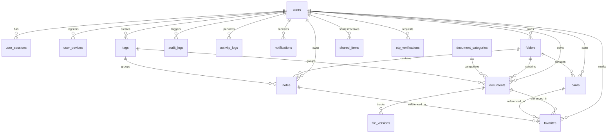
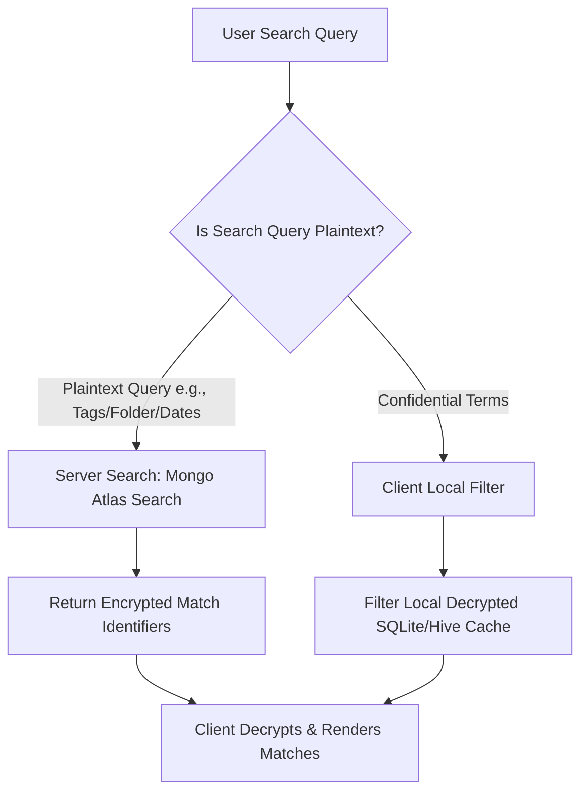

# Enterprise Database Design & Optimization Strategy - MongoDB Atlas

This document outlines the production-ready MongoDB Atlas database design for **Personal Vault**. The architecture leverages MongoDB’s flexible schema design while enforcing strict document validation, compound indexing, and zero-knowledge encryption boundaries.

---

## 1. Entity-Relationship (ER) Diagram

The relationships among the 16 core collections. Relationships are optimized for a highly distributed, document-oriented database.



---

## 2. Data Flow Diagram (DFD)

This diagram details the flow of write and read operations, highlighting the boundary where client-side encryption and decryption occur.

```mermaid
graph TD
    subgraph Client Application (Zero-Knowledge Zone)
        raw[Raw User Data / File]
        kdf[KDF Key Derivation]
        enc_engine[AES-256-GCM Encrypter]
        dec_engine[AES-256-GCM Decrypter]
        
        raw --> enc_engine
        kdf -->|Master Key| enc_engine
        kdf -->|Master Key| dec_engine
    end

    subgraph Express.js Backend Service
        api[REST Controller]
        val_mw[JSON Schema Validator]
        audit_mw[Audit Logger]
        r2_client[S3/R2 Client Manager]
        
        api --> val_mw
        api --> audit_mw
        api --> r2_client
    end

    subgraph Storage & Infrastructure
        mongo[(MongoDB Atlas)]
        r2[Cloudflare R2 Storage]
    end

    enc_engine -->|Encrypted Payload / Metadata| api
    val_mw -->|Validated Metadata| mongo
    r2_client -->|Encrypted Binary Block| r2
    
    mongo -->|Encrypted Document JSON| dec_engine
    r2 -->|Encrypted Binary Block| dec_engine
    dec_engine -->|Plaintext Data / File Viewer| user_view[Screen Render]
```

---

## 3. General Naming & Design Conventions
* **Database Name:** `personal_vault`
* **Collection Names:** All collections are plural, lowercase, and snake_case (e.g., `user_sessions`, `audit_logs`).
* **Fields:** All fields are camelCase (e.g., `userId`, `isFavorite`, `lastActiveAt`).
* **Identifiers:** Every document references `_id` as the primary key (`ObjectId`). External relationships use camelCase fields ending in `Id` (e.g., `userId`, `folderId`).
* **Timestamps:** Every collection schema (where logical) utilizes Mongoose automatic timestamps generating `createdAt` and `updatedAt` in ISO-8601 UTC format.

---

## 4. Collection-by-Collection Deep Dive

### 4.1 Users (`users`)
* **Purpose:** Core user profiles, authentication state, and client-side key derivation salts.
* **Relationships:** One-to-Many with `user_sessions`, `user_devices`, `folders`, `documents`, `cards`, and `notes`.
* **Validation Schema:**
  ```json
  {
    "$jsonSchema": {
      "bsonType": "object",
      "required": ["email", "passwordHash", "encryptionSalt", "role", "status"],
      "properties": {
        "email": { "bsonType": "string", "pattern": "^\\S+@\\S+\\.\\S+$" },
        "passwordHash": { "bsonType": "string" },
        "encryptionSalt": { "bsonType": "string", "minLength": 32 },
        "role": { "enum": ["user", "admin"] },
        "mfaEnabled": { "bsonType": "bool" },
        "mfaSecret": { "bsonType": ["string", "null"] },
        "status": { "enum": ["active", "suspended", "pending_verification"] }
      }
    }
  }
  ```
* **Indexes:**
  ```javascript
  db.users.createIndex({ email: 1 }, { unique: true });
  ```
* **Sample Document:**
  ```json
  {
    "_id": {"$oid": "60c72b2f9b1d8a23a41d5a71"},
    "email": "user@example.com",
    "passwordHash": "$2b$12$R9h/cIPz0gi.UR3t3yR2uO2K3T/q1yD1.v6r2aN2c/6m4u5G6a7b.",
    "encryptionSalt": "b7c2d9a4e8f1c3d5a7b9e0f2c4a6b8d0",
    "role": "user",
    "mfaEnabled": true,
    "mfaSecret": "U2FsdGVkX1+vGzQy...",
    "status": "active",
    "createdAt": "2026-06-22T18:00:00.000Z",
    "updatedAt": "2026-06-22T18:00:00.000Z"
  }
  ```

---

### 4.2 User Sessions (`user_sessions`)
* **Purpose:** Manages active user sessions, login tokens, and enables session revocation.
* **Relationships:** Many-to-One with `users` (`userId`).
* **Validation Schema:**
  ```json
  {
    "$jsonSchema": {
      "bsonType": "object",
      "required": ["userId", "refreshTokenHash", "expiresAt", "isRevoked"],
      "properties": {
        "userId": { "bsonType": "objectId" },
        "refreshTokenHash": { "bsonType": "string" },
        "ipAddress": { "bsonType": "string" },
        "userAgent": { "bsonType": "string" },
        "expiresAt": { "bsonType": "date" },
        "isRevoked": { "bsonType": "bool" }
      }
    }
  }
  ```
* **Indexes:**
  ```javascript
  db.user_sessions.createIndex({ userId: 1 });
  db.user_sessions.createIndex({ refreshTokenHash: 1 }, { unique: true });
  db.user_sessions.createIndex({ expiresAt: 1 }, { expireAfterSeconds: 0 }); // TTL index for auto-cleanup
  ```
* **Sample Document:**
  ```json
  {
    "_id": {"$oid": "60c72b2f9b1d8a23a41d5b12"},
    "userId": {"$oid": "60c72b2f9b1d8a23a41d5a71"},
    "refreshTokenHash": "e3b0c44298fc1c149afbf4c8996fb92427ae41e4649b934ca495991b7852b855",
    "ipAddress": "192.168.1.50",
    "userAgent": "Mozilla/5.0 (Windows NT 10.0; Win64; x64)...",
    "expiresAt": "2026-06-29T18:00:00.000Z",
    "isRevoked": false,
    "createdAt": "2026-06-22T18:00:00.000Z",
    "updatedAt": "2026-06-22T18:00:00.000Z"
  }
  ```

---

### 4.3 User Devices (`user_devices`)
* **Purpose:** Registers trusted devices for security reporting, push alerts, and login alerts.
* **Relationships:** Many-to-One with `users` (`userId`).
* **Validation Schema:**
  ```json
  {
    "$jsonSchema": {
      "bsonType": "object",
      "required": ["userId", "deviceFingerprint", "os", "isTrusted"],
      "properties": {
        "userId": { "bsonType": "objectId" },
        "deviceFingerprint": { "bsonType": "string" },
        "deviceName": { "bsonType": "string" },
        "os": { "enum": ["iOS", "Android", "macOS", "Windows", "Linux", "Web"] },
        "pushToken": { "bsonType": "string" },
        "isTrusted": { "bsonType": "bool" },
        "lastActiveAt": { "bsonType": "date" }
      }
    }
  }
  ```
* **Indexes:**
  ```javascript
  db.user_devices.createIndex({ userId: 1, deviceFingerprint: 1 }, { unique: true });
  ```
* **Sample Document:**
  ```json
  {
    "_id": {"$oid": "60c72b2f9b1d8a23a41d5c23"},
    "userId": {"$oid": "60c72b2f9b1d8a23a41d5a71"},
    "deviceFingerprint": "fp_98234791028347",
    "deviceName": "iPhone 15 Pro",
    "os": "iOS",
    "pushToken": "apns_token_xyz123abc...",
    "isTrusted": true,
    "lastActiveAt": "2026-06-22T18:30:00.000Z",
    "createdAt": "2026-06-22T18:00:00.000Z",
    "updatedAt": "2026-06-22T18:30:00.000Z"
  }
  ```

---

### 4.4 Folders (`folders`)
* **Purpose:** Logically organizes vault items. Folder names are encrypted client-side.
* **Relationships:** Many-to-One with `users` (`userId`), self-referencing Many-to-One (`parentFolderId`).
* **Validation Schema:**
  ```json
  {
    "$jsonSchema": {
      "bsonType": "object",
      "required": ["userId", "encryptedName"],
      "properties": {
        "userId": { "bsonType": "objectId" },
        "parentFolderId": { "bsonType": ["objectId", "null"] },
        "encryptedName": { "bsonType": "string" },
        "icon": { "bsonType": "string" },
        "color": { "bsonType": "string" }
      }
    }
  }
  ```
* **Indexes:**
  ```javascript
  db.folders.createIndex({ userId: 1, parentFolderId: 1 });
  ```
* **Sample Document:**
  ```json
  {
    "_id": {"$oid": "60c72b5a9b1d8a23a41d5a75"},
    "userId": {"$oid": "60c72b2f9b1d8a23a41d5a71"},
    "parentFolderId": null,
    "encryptedName": "U2FsdGVkX19sd...",
    "icon": "folder-medical",
    "color": "#e74c3c",
    "createdAt": "2026-06-22T18:00:00.000Z",
    "updatedAt": "2026-06-22T18:00:00.000Z"
  }
  ```

---

### 4.5 Documents (`documents`)
* **Purpose:** Stores encrypted file metadata and Cloudflare R2 object pointer links.
* **Relationships:** Many-to-One with `users`, `folders`, and `document_categories`. One-to-Many with `file_versions`.
* **Validation Schema:**
  ```json
  {
    "$jsonSchema": {
      "bsonType": "object",
      "required": ["userId", "encryptedTitle", "categoryId", "activeVersionId"],
      "properties": {
        "userId": { "bsonType": "objectId" },
        "folderId": { "bsonType": ["objectId", "null"] },
        "categoryId": { "bsonType": "objectId" },
        "activeVersionId": { "bsonType": "objectId" },
        "encryptedTitle": { "bsonType": "string" },
        "encryptedDescription": { "bsonType": "string" },
        "isArchived": { "bsonType": "bool" }
      }
    }
  }
  ```
* **Indexes:**
  ```javascript
  db.documents.createIndex({ userId: 1, folderId: 1 });
  db.documents.createIndex({ userId: 1, categoryId: 1 });
  db.documents.createIndex({ userId: 1, isArchived: 1 });
  ```
* **Sample Document:**
  ```json
  {
    "_id": {"$oid": "60c72b7a9b1d8a23a41d5a79"},
    "userId": {"$oid": "60c72b2f9b1d8a23a41d5a71"},
    "folderId": {"$oid": "60c72b5a9b1d8a23a41d5a75"},
    "categoryId": {"$oid": "60c72b9a9b1d8a23a41d5a90"},
    "activeVersionId": {"$oid": "60c72baa9b1d8a23a41d5b01"},
    "encryptedTitle": "U2FsdGVkX19md...",
    "encryptedDescription": "U2FsdGVkX19sZ...",
    "isArchived": false,
    "createdAt": "2026-06-22T18:10:00.000Z",
    "updatedAt": "2026-06-22T18:10:00.000Z"
  }
  ```

---

### 4.6 Cards (`cards`)
* **Purpose:** Stores credit/debit card credentials. All fields except basic layout options are fully encrypted client-side.
* **Relationships:** Many-to-One with `users` (`userId`), Many-to-One with `folders` (`folderId`, optional).
* **Validation Schema:**
  ```json
  {
    "$jsonSchema": {
      "bsonType": "object",
      "required": ["userId", "encryptedTitle", "encryptedPayload"],
      "properties": {
        "userId": { "bsonType": "objectId" },
        "folderId": { "bsonType": ["objectId", "null"] },
        "encryptedTitle": { "bsonType": "string" },
        "encryptedPayload": {
          "bsonType": "object",
          "required": ["cardholderName_enc", "cardNumber_enc", "expiryDate_enc", "cvv_enc"],
          "properties": {
            "cardholderName_enc": { "bsonType": "string" },
            "cardNumber_enc": { "bsonType": "string" },
            "expiryDate_enc": { "bsonType": "string" },
            "cvv_enc": { "bsonType": "string" },
            "cardType": { "bsonType": "string" }
          }
        },
        "cardBrand": { "enum": ["visa", "mastercard", "amex", "rupay", "other"] }
      }
    }
  }
  ```
* **Indexes:**
  ```javascript
  db.cards.createIndex({ userId: 1 });
  ```
* **Sample Document:**
  ```json
  {
    "_id": {"$oid": "60c72c1a9b1d8a23a41d5d05"},
    "userId": {"$oid": "60c72b2f9b1d8a23a41d5a71"},
    "folderId": null,
    "encryptedTitle": "U2FsdGVkX19jZ...",
    "encryptedPayload": {
      "cardholderName_enc": "U2FsdGVkX19...",
      "cardNumber_enc": "U2FsdGVkX19...",
      "expiryDate_enc": "U2FsdGVkX19...",
      "cvv_enc": "U2FsdGVkX19...",
      "cardType": "debit"
    },
    "cardBrand": "visa",
    "createdAt": "2026-06-22T18:15:00.000Z",
    "updatedAt": "2026-06-22T18:15:00.000Z"
  }
  ```

---

### 4.7 Notes (`notes`)
* **Purpose:** Stores secure text logs, credentials, or password recovery checklists.
* **Relationships:** Many-to-One with `users` (`userId`), Many-to-One with `folders` (`folderId`, optional).
* **Validation Schema:**
  ```json
  {
    "$jsonSchema": {
      "bsonType": "object",
      "required": ["userId", "encryptedTitle", "encryptedBody"],
      "properties": {
        "userId": { "bsonType": "objectId" },
        "folderId": { "bsonType": ["objectId", "null"] },
        "encryptedTitle": { "bsonType": "string" },
        "encryptedBody": { "bsonType": "string" }
      }
    }
  }
  ```
* **Indexes:**
  ```javascript
  db.notes.createIndex({ userId: 1, folderId: 1 });
  ```
* **Sample Document:**
  ```json
  {
    "_id": {"$oid": "60c72c2a9b1d8a23a41d5e12"},
    "userId": {"$oid": "60c72b2f9b1d8a23a41d5a71"},
    "folderId": {"$oid": "60c72b5a9b1d8a23a41d5a75"},
    "encryptedTitle": "U2FsdGVkX19ud...",
    "encryptedBody": "U2FsdGVkX19ie...",
    "createdAt": "2026-06-22T18:20:00.000Z",
    "updatedAt": "2026-06-22T18:20:00.000Z"
  }
  ```

---

### 4.8 Document Categories (`document_categories`)
* **Purpose:** System-wide or user-scoped categories (e.g. Identity, Health, Legal).
* **Relationships:** One-to-Many with `documents`.
* **Validation Schema:**
  ```json
  {
    "$jsonSchema": {
      "bsonType": "object",
      "required": ["name", "slug", "isSystem"],
      "properties": {
        "userId": { "bsonType": ["objectId", "null"] }, // null if system category
        "name": { "bsonType": "string" },
        "slug": { "bsonType": "string" },
        "isSystem": { "bsonType": "bool" }
      }
    }
  }
  ```
* **Indexes:**
  ```javascript
  db.document_categories.createIndex({ slug: 1 }, { unique: true });
  db.document_categories.createIndex({ userId: 1 });
  ```
* **Sample Document:**
  ```json
  {
    "_id": {"$oid": "60c72b9a9b1d8a23a41d5a90"},
    "userId": null,
    "name": "Identity Documents",
    "slug": "identity-documents",
    "isSystem": true,
    "createdAt": "2026-06-22T18:00:00.000Z",
    "updatedAt": "2026-06-22T18:00:00.000Z"
  }
  ```

---

### 4.9 File Versions (`file_versions`)
* **Purpose:** Historical log of uploads per document to track version states and support rollbacks.
* **Relationships:** Many-to-One with `documents` (`documentId`).
* **Validation Schema:**
  ```json
  {
    "$jsonSchema": {
      "bsonType": "object",
      "required": ["documentId", "versionNumber", "r2Key", "fileSize", "fileMimeType", "checksum", "encryptedFileKey"],
      "properties": {
        "documentId": { "bsonType": "objectId" },
        "versionNumber": { "bsonType": "int" },
        "r2Key": { "bsonType": "string" },
        "fileSize": { "bsonType": "long" },
        "fileMimeType": { "bsonType": "string" },
        "checksum": { "bsonType": "string" },
        "encryptedFileKey": { "bsonType": "string" },
        "iv": { "bsonType": "string" },
        "authTag": { "bsonType": "string" }
      }
    }
  }
  ```
* **Indexes:**
  ```javascript
  db.file_versions.createIndex({ documentId: 1, versionNumber: -1 }, { unique: true });
  db.file_versions.createIndex({ r2Key: 1 }, { unique: true });
  ```
* **Sample Document:**
  ```json
  {
    "_id": {"$oid": "60c72baa9b1d8a23a41d5b01"},
    "documentId": {"$oid": "60c72b7a9b1d8a23a41d5a79"},
    "versionNumber": 1,
    "r2Key": "users/60c72b2f9b1d8a23a41d5a71/identity_documents/60c72b7a_v1.bin",
    "fileSize": {"$numberLong": "2048576"},
    "fileMimeType": "application/pdf",
    "checksum": "8f434346648f6b96df89dda901c5176b10a6d83961dd3c1ac88d429cf90b9b6f",
    "encryptedFileKey": "U2FsdGVkX19ma2V5...",
    "iv": "3d9a2c1f8b4e",
    "authTag": "f8a9e7d6",
    "createdAt": "2026-06-22T18:10:00.000Z",
    "updatedAt": "2026-06-22T18:10:00.000Z"
  }
  ```

---

### 4.10 Audit Logs (`audit_logs`)
* **Purpose:** High-security immutable compliance ledger tracking critical events.
* **Relationships:** Many-to-One with `users` (`userId`, optional).
* **Validation Schema:**
  ```json
  {
    "$jsonSchema": {
      "bsonType": "object",
      "required": ["action", "ipAddress", "userAgent", "status", "timestamp"],
      "properties": {
        "userId": { "bsonType": ["objectId", "null"] },
        "action": { "bsonType": "string" },
        "ipAddress": { "bsonType": "string" },
        "userAgent": { "bsonType": "string" },
        "status": { "enum": ["success", "failure"] },
        "details": { "bsonType": "string" },
        "timestamp": { "bsonType": "date" }
      }
    }
  }
  ```
* **Indexes:**
  ```javascript
  db.audit_logs.createIndex({ userId: 1, timestamp: -1 });
  db.audit_logs.createIndex({ timestamp: 1 }, { expireAfterSeconds: 31536000 }); // TTL index: 1 year retention
  ```
* **Sample Document:**
  ```json
  {
    "_id": {"$oid": "60c72baa9b1d8a23a41d5c99"},
    "userId": {"$oid": "60c72b2f9b1d8a23a41d5a71"},
    "action": "FILE_DOWNLOAD_REQUEST",
    "ipAddress": "192.168.1.50",
    "userAgent": "Mozilla/5.0 (Windows NT 10.0; Win64; x64)...",
    "status": "success",
    "details": "Document ID: 60c72b7a9b1d8a23a41d5a79, Version: 1",
    "timestamp": "2026-06-22T18:12:00.000Z"
  }
  ```

---

### 4.11 Notifications (`notifications`)
* **Purpose:** Stores in-app alerts (e.g. document/insurance expiry reminders, system security alerts).
* **Relationships:** Many-to-One with `users` (`userId`).
* **Validation Schema:**
  ```json
  {
    "$jsonSchema": {
      "bsonType": "object",
      "required": ["userId", "title", "message", "type", "isRead"],
      "properties": {
        "userId": { "bsonType": "objectId" },
        "title": { "bsonType": "string" },
        "message": { "bsonType": "string" },
        "type": { "enum": ["expiry_alert", "security_alert", "system_alert", "sharing"] },
        "isRead": { "bsonType": "bool" },
        "referenceId": { "bsonType": ["objectId", "null"] } // Links to document/card/note trigger
      }
    }
  }
  ```
* **Indexes:**
  ```javascript
  db.notifications.createIndex({ userId: 1, isRead: 1 });
  db.notifications.createIndex({ createdAt: 1 }, { expireAfterSeconds: 2592000 }); // TTL index: 30 days retention
  ```
* **Sample Document:**
  ```json
  {
    "_id": {"$oid": "60c72baa9b1d8a23a41d5d11"},
    "userId": {"$oid": "60c72b2f9b1d8a23a41d5a71"},
    "title": "Insurance Policy Expiring",
    "message": "Your car insurance policy will expire in 5 days.",
    "type": "expiry_alert",
    "isRead": false,
    "referenceId": {"$oid": "60c72b7a9b1d8a23a41d5a79"},
    "createdAt": "2026-06-22T18:00:00.000Z",
    "updatedAt": "2026-06-22T18:00:00.000Z"
  }
  ```

---

### 4.12 Activity Logs (`activity_logs`)
* **Purpose:** Diagnostic log of user interactions, displayed in-app to show history (separated from read-heavy security audit logs).
* **Relationships:** Many-to-One with `users` (`userId`).
* **Validation Schema:**
  ```json
  {
    "$jsonSchema": {
      "bsonType": "object",
      "required": ["userId", "description", "timestamp"],
      "properties": {
        "userId": { "bsonType": "objectId" },
        "description": { "bsonType": "string" },
        "targetType": { "enum": ["document", "card", "note", "folder"] },
        "targetId": { "bsonType": "objectId" },
        "timestamp": { "bsonType": "date" }
      }
    }
  }
  ```
* **Indexes:**
  ```javascript
  db.activity_logs.createIndex({ userId: 1, timestamp: -1 });
  db.activity_logs.createIndex({ timestamp: 1 }, { expireAfterSeconds: 7776000 }); // TTL index: 90 days retention
  ```
* **Sample Document:**
  ```json
  {
    "_id": {"$oid": "60c72baa9b1d8a23a41d5d55"},
    "userId": {"$oid": "60c72b2f9b1d8a23a41d5a71"},
    "description": "Uploaded insurance policy copy",
    "targetType": "document",
    "targetId": {"$oid": "60c72b7a9b1d8a23a41d5a79"},
    "timestamp": "2026-06-22T18:10:00.000Z"
  }
  ```

---

### 4.13 Favorites (`favorites`)
* **Purpose:** Quick-access mappings for files, cards, or notes marked by users.
* **Relationships:** Many-to-One with `users` (`userId`), Polymorphic target mapping (`targetId`).
* **Validation Schema:**
  ```json
  {
    "$jsonSchema": {
      "bsonType": "object",
      "required": ["userId", "targetId", "targetModel"],
      "properties": {
        "userId": { "bsonType": "objectId" },
        "targetId": { "bsonType": "objectId" },
        "targetModel": { "enum": ["documents", "cards", "notes"] }
      }
    }
  }
  ```
* **Indexes:**
  ```javascript
  db.favorites.createIndex({ userId: 1, targetId: 1 }, { unique: true });
  ```
* **Sample Document:**
  ```json
  {
    "_id": {"$oid": "60c72baa9b1d8a23a41d5e99"},
    "userId": {"$oid": "60c72b2f9b1d8a23a41d5a71"},
    "targetId": {"$oid": "60c72b7a9b1d8a23a41d5a79"},
    "targetModel": "documents",
    "createdAt": "2026-06-22T18:11:00.000Z",
    "updatedAt": "2026-06-22T18:11:00.000Z"
  }
  ```

---

### 4.14 Tags (`tags`)
* **Purpose:** Organizes items across folders and categories. Tag titles are client-side encrypted.
* **Relationships:** Many-to-One with `users` (`userId`).
* **Validation Schema:**
  ```json
  {
    "$jsonSchema": {
      "bsonType": "object",
      "required": ["userId", "encryptedName"],
      "properties": {
        "userId": { "bsonType": "objectId" },
        "encryptedName": { "bsonType": "string" },
        "color": { "bsonType": "string" }
      }
    }
  }
  ```
* **Indexes:**
  ```javascript
  db.tags.createIndex({ userId: 1, encryptedName: 1 }, { unique: true });
  ```
* **Sample Document:**
  ```json
  {
    "_id": {"$oid": "60c72baa9b1d8a23a41d5f21"},
    "userId": {"$oid": "60c72b2f9b1d8a23a41d5a71"},
    "encryptedName": "U2FsdGVkX190YW...",
    "color": "#3498db",
    "createdAt": "2026-06-22T18:05:00.000Z",
    "updatedAt": "2026-06-22T18:05:00.000Z"
  }
  ```

---

### 4.15 Shared Items (`shared_items`)
* **Purpose:** Facilitates secure, encrypted peer-to-peer item sharing via temporary shared access structures.
* **Relationships:** Many-to-One with `users` (`sharedByUserId` and `sharedWithUserId`), Polymorphic target mapping (`targetId`).
* **Validation Schema:**
  ```json
  {
    "$jsonSchema": {
      "bsonType": "object",
      "required": ["sharedByUserId", "sharedWithUserId", "targetId", "targetModel", "encryptedSharedKey", "expiresAt"],
      "properties": {
        "sharedByUserId": { "bsonType": "objectId" },
        "sharedWithUserId": { "bsonType": "objectId" },
        "targetId": { "bsonType": "objectId" },
        "targetModel": { "enum": ["documents", "cards", "notes"] },
        // Item's symmetric key, re-encrypted with recipient's public key
        "encryptedSharedKey": { "bsonType": "string" },
        "expiresAt": { "bsonType": "date" }
      }
    }
  }
  ```
* **Indexes:**
  ```javascript
  db.shared_items.createIndex({ sharedWithUserId: 1, targetId: 1 }, { unique: true });
  db.shared_items.createIndex({ expiresAt: 1 }, { expireAfterSeconds: 0 }); // Auto-expire sharing permissions
  ```
* **Sample Document:**
  ```json
  {
    "_id": {"$oid": "60c72baa9b1d8a23a41d5f88"},
    "sharedByUserId": {"$oid": "60c72b2f9b1d8a23a41d5a71"},
    "sharedWithUserId": {"$oid": "60c72b2f9b1d8a23a41d5a99"},
    "targetId": {"$oid": "60c72b7a9b1d8a23a41d5a79"},
    "targetModel": "documents",
    "encryptedSharedKey": "U2FsdGVkX19zaGFyZWRLZXlBc3ltbWV0cmlj...",
    "expiresAt": "2026-06-23T18:00:00.000Z",
    "createdAt": "2026-06-22T18:00:00.000Z",
    "updatedAt": "2026-06-22T18:00:00.000Z"
  }
  ```

---

### 4.16 OTP Verifications (`otp_verifications`)
* **Purpose:** Stores transient MFA/transaction verification OTP codes.
* **Relationships:** Many-to-One with `users` (`userId`, optional).
* **Validation Schema:**
  ```json
  {
    "$jsonSchema": {
      "bsonType": "object",
      "required": ["recipient", "otpHash", "actionType", "attempts", "expiresAt"],
      "properties": {
        "userId": { "bsonType": ["objectId", "null"] },
        "recipient": { "bsonType": "string" }, // Email or mobile phone number
        "otpHash": { "bsonType": "string" },
        "actionType": { "enum": ["registration", "password_reset", "mfa_login"] },
        "attempts": { "bsonType": "int", "minimum": 0, "maximum": 5 },
        "expiresAt": { "bsonType": "date" }
      }
    }
  }
  ```
* **Indexes:**
  ```javascript
  db.otp_verifications.createIndex({ recipient: 1, actionType: 1 });
  db.otp_verifications.createIndex({ expiresAt: 1 }, { expireAfterSeconds: 0 }); // TTL index for OTP expiration
  ```
* **Sample Document:**
  ```json
  {
    "_id": {"$oid": "60c72baa9b1d8a23a41d6012"},
    "userId": {"$oid": "60c72b2f9b1d8a23a41d5a71"},
    "recipient": "user@example.com",
    "otpHash": "$2b$10$xyz123abc456...", // Hashed OTP code (e.g. 123456)
    "actionType": "mfa_login",
    "attempts": 0,
    "expiresAt": "2026-06-22T23:45:50.000Z",
    "createdAt": "2026-06-22T23:40:50.000Z",
    "updatedAt": "2026-06-22T23:40:50.000Z"
  }
  ```

---

## 5. MongoDB Optimization Strategy

### 5.1 Connection Pooling & Sizing
* **Pool Configuration:** Enforce a connection pool size (e.g. `maxPoolSize = 100`, `minPoolSize = 10`) inside the Mongoose client backend properties to prevent driver instantiation bottlenecks under spikes.
* **Keep-Alive:** Set `keepAlive: true` and configure server-side socket timeout parameters (`socketTimeoutMS: 30000`, `connectTimeoutMS: 30000`) to quickly recover drop-offs.

### 5.2 Write Concerns & Read Preferences
* **Write Concerns:** 
  * Use `w: "majority"` with `j: true` (Journaling validation) for billing, membership statuses, and document uploads.
  * Use `w: 1` (Acknowledge) for high-frequency logs like `activity_logs` and `notifications` to optimize performance.
* **Read Preferences:** Set `readPreference: "primary"` for core authentication, item edits, and sharing configurations. Set `readPreference: "secondaryPreferred"` for analytics portals, system logging feeds, and audit trail extractions.

### 5.3 Storage Size Mitigation
* **Polymorphism Limits:** By keeping payload variables as generic `Mixed` structures, MongoDB natively packs properties dynamically.
* **Orphan Cleanup Policy:** Use background triggers/cron scripts on Node backend to run cascade deletions. Removing a `document` object executes:
  1. Cascade deletion of associated `file_versions` in MongoDB.
  2. Multi-object deletion hooks to Cloudflare R2 to purge binary storage keys.
  3. Deletion of related `favorites` and `shared_items` references.

---

## 6. Search Optimization Strategy

Because Personal Vault uses client-side encryption, standard MongoDB text indexing is limited to plaintext metadata. The search design uses a hybrid strategy:



### 6.1 Server-Side Atlas Search
For metadata that is safe to expose (e.g. custom system category tags, file mime-types, date creation boundaries, and folder layouts):
* **Atlas Search Index Configuration:** Set up Lucene-based search mapping.
  ```json
  {
    "mappings": {
      "dynamic": false,
      "fields": {
        "categoryId": { "type": "objectId" },
        "isArchived": { "type": "boolean" },
        "createdAt": { "type": "date" }
      }
    }
  }
  ```

### 6.2 Client-Side Indexing and Decryption Cache
For confidential titles and tag filters (which are client-side encrypted):
1. **Metadata Pre-fetching:** When the client logs in, it pre-fetches the database listing containing `_id`, `encryptedTitle`, and `encryptedTags`.
2. **Local Key Derivation Cache:** The client decrypts these small metadata properties and populates an in-memory index database (SQLite/Hive on Mobile, IndexedDB on Web).
3. **Instant Filter Response:** When the user types in the search bar, the UI filters this local decrypted index in real-time, yielding instant search results.
