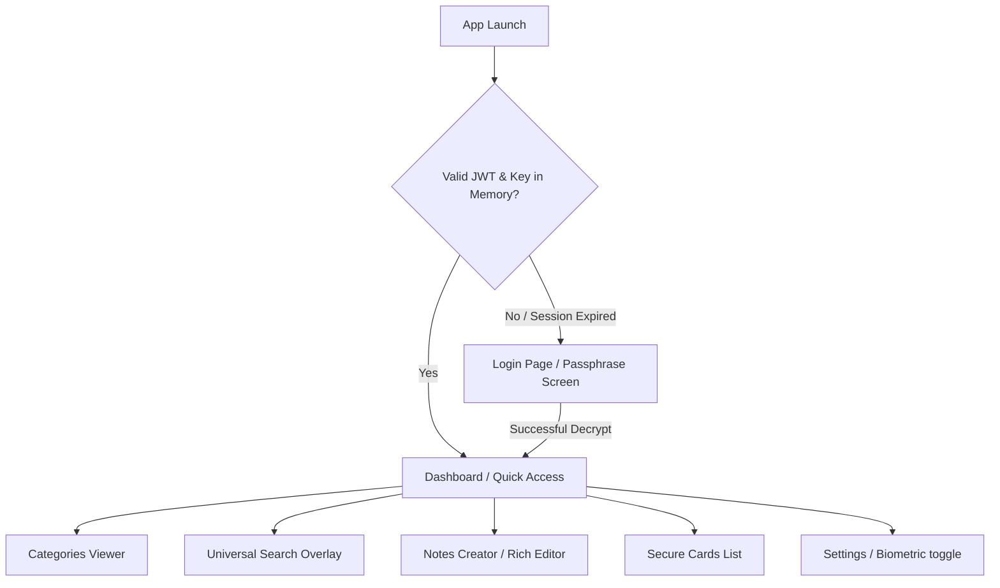
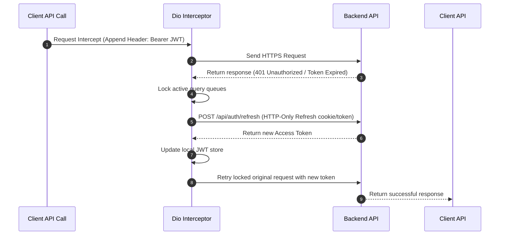

# Flutter Application Architecture & Security Blueprint - Personal Vault

This document outlines the complete, production-ready frontend architecture for the **Personal Vault** mobile application. Built using Flutter, it implements a strict **MVVM (Model-View-ViewModel)** architectural pattern, reactive state management via **GetX**, and an offline-first secure encryption cache.

---

## 1. Architectural Overview (MVVM + GetX)

The mobile application decouples UI layout from business logic using the MVVM pattern combined with GetX for dependency injection and state management.

```mermaid
graph TD
    subgraph View Layer
        view[Widget / Screen<br>Views]
    end

    subgraph Presentation Layer (ViewModel)
        vm[ViewModel<br>GetxController]
    end

    subgraph Service / Data Layer
        repo[Repositories]
        api_srv[Dio API Service]
        local_srv[Secure Offline Cache]
        crypto_srv[Cryptographic Engine]
    end

    view -->|Observes state & calls methods| vm
    vm -->|State updates via Rx variables| view
    vm -->|Requests data| repo
    repo -->|Symmetric cryptographic actions| crypto_srv
    repo -->|Fetches network data| api_srv
    repo -->|Fetches cached backups| local_srv
```

* **Views:** Build the declarative UI layouts (Stateless/Stateful widgets). They contain zero business logic and bind directly to ViewModels using GetX reactive observers (`Obx` or `GetX`).
* **ViewModels (GetxControllers):** Manage UI state variables, fetch data through Repositories, and react to lifecycle states (init, ready, close).
* **Repositories:** Act as the single source of truth, coordinating offline database access (cache) and remote network requests.
* **Services:** Stateless helper utilities providing low-level operations (cryptography, HTTP connections, OS biometrics access).

---

## 2. Navigation Structure

The application maps navigation flows using named routes with route guards (middlewares) checking session flags:



### 2.1 Route Catalog
* `Routes.SPLASH`: Core loading and session verification checkpoint.
* `Routes.LOGIN`: Passphrase unlock and authentication view.
* `Routes.REGISTER`: Onboarding and salt-generation view.
* `Routes.DASHBOARD`: Parent scaffold containing quick-access sections, category tiles, and bottom navbar controls.
* `Routes.VAULT_DETAILS`: Categorized listings of document cards.
* `Routes.NOTE_EDITOR`: Rich text note view/create.
* `Routes.CARD_CREATOR`: Card details input panel.
* `Routes.SETTINGS`: MFA enrollments, biometric toggles, and session revoke options.

---

## 3. Directory Layout

```text
lib/
├── core/                     # Common core utils and styling
│   ├── constants/            # API endpoints, string keys, and assets
│   ├── theme/                # Custom Dark Mode colors, typography, styles
│   └── utils/                # Date formatters, file pickers, device specs
├── models/                   # Plain Dart objects representing data schemas
│   ├── user.dart
│   ├── folder.dart
│   ├── vault_item.dart
│   └── session.dart
├── services/                 # Hardware/Network interface clients
│   ├── api_service.dart      # Dio wrapper with refresh token interceptors
│   ├── crypto_service.dart   # PBKDF2 key derivation & AES-256-GCM algorithms
│   ├── biometric_service.dart# local_auth OS Fingerprint/FaceID hooks
│   └── cache_service.dart    # Hive/SQLite secure storage instance
├── repositories/             # Mediators between network API and local Cache
│   ├── auth_repository.dart
│   └── vault_repository.dart
├── viewmodels/               # GetxController presentation controllers
│   ├── auth_viewmodel.dart
│   ├── dashboard_viewmodel.dart
│   ├── notes_viewmodel.dart
│   └── settings_viewmodel.dart
├── views/                    # Declare UI Screens (MVVM Views)
│   ├── auth/
│   │   ├── login_view.dart
│   │   └── register_view.dart
│   ├── dashboard/
│   │   └── dashboard_view.dart
│   ├── notes/
│   │   └── note_editor_view.dart
│   └── settings/
│       └── settings_view.dart
├── widgets/                  # Atomic reusable UI components
│   ├── custom_button.dart
│   ├── document_card.dart
│   └── glass_panel.dart
└── main.dart                 # Application bootstrap entry point
```

---

## 4. State Management Strategy (Reactive GetX)

* **Reactive Observables:** ViewModels wrap native models inside GetX reactive wrappers (e.g. `RxList<VaultItem>`, `RxBool isLoading`, `Rxn<User>`).
* **Dependency Injection (Bindings):** Binding modules instantiate ViewModels lazily on transition:
  ```dart
  Get.lazyPut<DashboardViewModel>(() => DashboardViewModel(vaultRepository: Get.find()));
  ```
* **State Lifecycles:** GetxControllers trigger metadata updates inside `onInit()` and release cryptographic materials from memory inside `onClose()`.

---

## 5. API Integration Strategy (Dio + Interceptors)

The application implements a robust network interface leveraging the **Dio** client:



* **Network Interceptors:** A unified interceptor appends active `Bearer AccessToken` header tokens, logs exceptions to Sentry/Crashlytics, and triggers session refreshes on `401 Unauthorized` states without breaking UI workflows.
* **Multipart Chunk Streaming:** Directly slices local encrypted document binaries and handles progress listeners during multi-chunk R2 file uploads.

---

## 6. Offline Caching Strategy (Secured Hive Cache)

To enable instant access (within 3 seconds) under weak network configurations, metadata is securely cached locally:

* **Symmetric Database Encryption:** We use **Hive** for local caching. Hive boxes are encrypted using an AES-256 key generated locally via `Hive.generateSecureKey()`.
* **Key Preservation:** The encryption key is written to the device's secure system vault using **`flutter_secure_storage`** (Keychain on iOS, Keystore on Android).
* **Automatic Cache Syncing:**
  * When online, fetching vault listings updates the local encrypted Hive boxes.
  * When offline, the Repository returns cached listings, showing client-side decrypted titles and preview thumbnails.

---

## 7. Security & Cryptographic Strategy

* **Biometric Auth Integration:** Local biometrics (`local_auth`) do *not* encrypt data. Instead, biometrics are used to retrieve the locally stored master key password hash from the OS Secure Keystore/Keychain, which then decrypts the local Hive boxes.
* **Memory Protection (Key Wiping):** As soon as the application is minimized, sent to background, or locked, the Master Key is securely zeroed out (overwritten in memory) to prevent heap-inspection exploits.
* **Certificate Pinning:** The Dio client utilizes SSL Pinning to prevent Man-in-the-Middle (MITM) proxy attacks.
* **Obfuscation:** Standard ProGuard (Android) and compiler optimization flags (iOS) are enabled in release pipelines to obfuscate class mappings and protect the cryptographic engine from reverse engineering.
