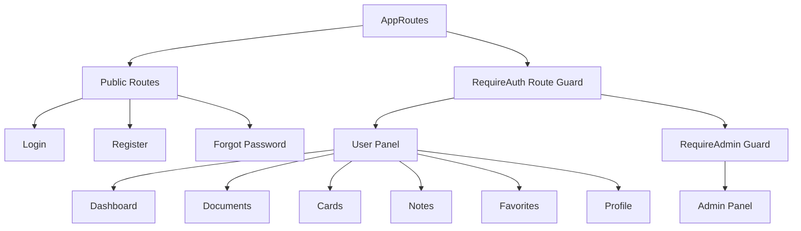

# React.js Web Application Architecture & Security Blueprint - Personal Vault

This document details the complete React.js web client architecture for the **Personal Vault** administrative and desktop portal. The design utilizes **Bootstrap 5** for responsive styling, **Redux Toolkit** for state management, **Axios** for network synchronization, and the **WebCrypto API** for client-side zero-knowledge encryption operations.

---

## 1. Folder Structure

```text
src/
├── assets/                   # Static images, custom icons, global variables
│   └── styles/
│       ├── _variables.scss   # Bootstrap 5 theme customizations (Colors, spacings)
│       └── custom.scss       # Global CSS overrides (Glassmorphism, animations)
├── components/               # Atomic reusable components
│   ├── common/               # Spinners, buttons, input fields, badge icons
│   ├── layout/               # Sidebar navigation, navbar, footer, page scaffolds
│   └── vault/                # DocumentCard, CardItemGrid, NoteRichEditor
├── features/                 # Redux Toolkit Slices (Business state scopes)
│   ├── auth/
│   │   └── authSlice.js      # Session, loading states, MFA tokens
│   ├── vault/
│   │   └── vaultSlice.js     # Documents list, active folders, cards, notes
│   └── admin/
│       └── adminSlice.js     # Paginated users list, audit records, metrics
├── hooks/                    # Reusable custom hooks
│   ├── useAuth.js            # Quick login/logout access wrappers
│   ├── useCrypto.js          # WebCrypto key derivations and AES decryption triggers
│   └── useChunkUpload.js     # Segment fragmentation, encryption, and streaming
├── pages/                    # Main route view containers
│   ├── Auth/                 # Login, Register, ForgotPassword, MFA Challenge
│   ├── Dashboard/            # Dashboard stats, universal search, recent items
│   ├── Documents/            # Folder explorer, list/grid document entries
│   ├── Cards/                # Credit/debit card metadata grid
│   ├── Notes/                # Encrypted rich text notepad editor
│   ├── Settings/             # Passphrase changes, MFA TOTP enrollments
│   ├── Profile/              # User preferences, registered devices
│   └── Admin/                # Global usage statistics, user lists, audits
├── routes/                   # Routing configuration mapping
│   ├── AppRoutes.jsx         # Router orchestrator (React Router Dom)
│   ├── RequireAuth.jsx       # Route Guard checking for active JWT tokens
│   └── RequireAdmin.jsx      # Route Guard enforcing 'admin' role claims
├── services/                 # Raw interface connections
│   ├── api.js                # Axios client configurations with interceptors
│   └── crypto.service.js     # WebCrypto wrapper for local cryptographic actions
├── store/                    # Redux Toolkit Store configuration
│   └── index.js
├── utils/                    # Common helper utilities
│   ├── sanitization.js       # DOMPurify wrapping for rich-text notes XSS prevention
│   └── formatters.js         # File size calculations, date mappings
├── App.jsx                   # Layout mappings and wrapper contexts
└── main.jsx                  # Application mounting entry point
```

---

## 2. Routing Architecture (React Router v6)

The application uses declarative routing, protecting user namespaces via route-guard layouts:



* **`RequireAuth`:** Intercepts access to authenticated workspaces. If no JWT token is stored in memory, it redirects to the login route.
* **`RequireAdmin`:** Intercepts access to the administrative workspace. If the active JWT role payload is not `admin`, it displays a `403 Forbidden` view.

---

## 3. Component Architecture

The interface uses a modular, decoupled atomic component model:

* **Atomic UI Elements (`components/common/`):** Generic inputs, buttons, and loading states. These receive styles via props and Bootstrap classes, remaining isolated from global state.
* **Feature Components (`components/vault/`):** Connect directly to Redux selectors (e.g. `useSelector`) to fetch local encrypted blocks, triggering local decryption utility hooks on rendering.
* **Layout Wrapper Scaffolds (`components/layout/`):** Wrap views with standard sidebars, navigation headers, and responsive drawers.

---

## 4. API Layer (Axios Interceptors)

The Axios API client (`services/api.js`) handles session token rotation dynamically:

* **Authorization Headers:** Injects the active `Bearer accessToken` from Redux memory into every request automatically.
* **Refreshes via Interceptor:** If an API endpoint returns a `401 Unauthorized` (access token expired), the Axios response interceptor intercepts the failure, locks the request queue, makes a request to `/api/auth/refresh` (sending the HttpOnly refresh token cookie), updates the Redux store, and retries the failed requests.

---

## 5. State Management (Redux Toolkit)

The store maintains a single-source state structure:

```javascript
// Redux Store Slice Mappings
{
  auth: {
    accessToken: "eyJhbGciOi...",
    isAuthenticated: true,
    mfaRequired: false,
    tempToken: null,
    user: { id: "123", email: "user@example.com", role: "user" }
  },
  vault: {
    documents: [],
    cards: [],
    notes: [],
    folders: [],
    activeFolderId: null,
    searchQuery: "",
    favorites: [],
    isLoading: false,
    error: null
  },
  admin: {
    usersList: [],
    auditLogs: [],
    systemStats: {},
    isLoading: false
  }
}
```

---

## 6. Authentication Flow (JWT & MFA)

1. **Authentication:** The user logs in via email and password (derived key).
2. **Access Token Storage:** The API server returns the access token, which is stored in Redux state (in-memory).
3. **Refresh Token Storage:** The server sets the refresh token in a secure, `HttpOnly`, `SameSite=Strict`, `Secure` cookie named `jid`. This token is never accessible to Javascript, preventing Cross-Site Scripting (XSS) leaks.
4. **MFA Verification:** If MFA is enabled, the server returns `mfaRequired: true` and a temporary session token. The app renders the OTP form, posts verification data, and receives the final access/refresh tokens.

---

## 7. Security Strategy

* **Zero-Knowledge Key Derivation:** Cryptographic actions leverage the browser's native **WebCrypto API** (leveraging hardware-accelerated AES and SHA engines).
* **Sanitization:** Rich text note rendering uses **DOMPurify** to sanitize HTML body inputs before inserting them into the DOM, mitigating XSS risks.
* **Memory Protections:** The derived `masterKey` is stored only in React state memory. Wiping this state (e.g. on logout, window close, or inactivity timeout) completely removes the keys.
* **CSP Headers:** Implements a strict Content Security Policy configuration restricting connections exclusively to the backend API server, Cloudflare R2 endpoints, and trusted CDNs.

---

## 8. Responsive Design Strategy (Bootstrap 5)

* **CSS Grid & Flexbox:** View layouts are fluid and styled using Bootstrap 5 utility classes.
* **Adaptive Breakpoints:** Sidebar navigation dynamically transforms into an offcanvas side drawer on mobile and tablet viewports (`<992px` width).
* **Fluid Grid Sizing:** Document explorer layouts scale columns dynamically:
  * Mobile (`col-12`)
  * Tablet (`col-md-6` / `col-md-4`)
  * Desktop (`col-lg-3`)
