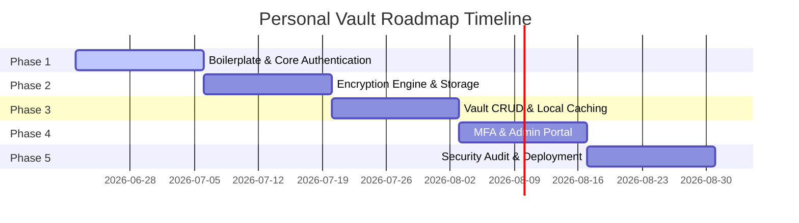

# Development Roadmap - Personal Vault

To bring the Personal Vault project from conception to a production-ready, secure deployment, we will execute a structured, **5-Phase Development Roadmap** spanning **10 weeks**.

---

## Phase 1: Foundation & Core Authentication (Weeks 1-2)
* **Goal:** Build backend scaffolding and establish secure JWT-based authentication pipelines across web and mobile.

### Deliverables
1. **Scaffolding:** Initialize git monorepo. Create Express, React, and Flutter base directory configurations. Configure Docker for backend development.
2. **Database Config:** Provision development MongoDB Atlas instance. Map User, Folder, and Audit Log Mongoose collections with indices.
3. **Authentication APIs:** Create `/api/auth/register`, `/api/auth/login`, and `/api/auth/refresh` endpoints. Add Bcrypt hashing.
4. **Client Auth Integration:**
   * **Flutter:** Implement MVVM onboarding modules using GetX. Set up secure session state (GetxService + Secure Storage).
   * **React:** Style standard Login/Register interfaces with Bootstrap 5. Implement Axios interceptors and global `AuthContext`.

---

## Phase 2: Client Encryption & Cloudflare R2 Storage (Weeks 3-4)
* **Goal:** Implement the client-side cryptographic engine and S3-compatible cloud storage operations.

### Deliverables
1. **Cryptographic Core:**
   * **Web:** Integrate WebCrypto API to handle local PBKDF2 master key derivation and AES-256-GCM file-encryption/decryption.
   * **Mobile:** Implement matching encryption mechanics using Dart's `cryptography` or `pointycastle` packages.
2. **Cloudflare R2 Backend Service:** Write Express `r2.service.js` utilizing the S3 SDK Client to generate presigned URLs and stream files directly.
3. **Chunk Upload Protocols:** Write custom chunk-merging Express controllers, including file-segment caching and SHA-256 integrity validation.
4. **Client Upload Handlers:** Integrate custom upload hooks/controllers in Web/Mobile to fragment, encrypt, and stream file slices sequentially.

---

## Phase 3: Core Vault Features & Offline Caching (Weeks 5-6)
* **Goal:** Implement document, note, and card CRUD features with local caching capabilities.

### Deliverables
1. **Vault Item APIs:** Build polymorphic endpoints for CRUD operations on documents, notes, cards, and credentials.
2. **Folders Integration:** Enable folder creation and organization filters.
3. **Mobile Offline Cache:** Setup Hive/SQLite databases in Flutter. Automatically store encrypted document metadata and cache previously downloaded decrypted binaries securely.
4. **Universal Search Engine:** Implement tag search and title matching using indices in MongoDB. Add client-side in-memory filter overlays.

---

## Phase 4: MFA & Admin Operations Portal (Weeks 7-8)
* **Goal:** Strengthen vault access controls and build administrative overhead dashboards.

### Deliverables
1. **Multi-Factor Auth (MFA):** Set up TOTP generation on the backend. Add interactive QR code enrollment screens to React and Flutter.
2. **System Auditing:** Implement automated audit logging controllers tracking all document reads/writes, logouts, and validation failures. Set up Mongo TTL policy.
3. **Admin metrics API:** Create metrics aggregation endpoints queryable only by users containing the `'admin'` role claim.
4. **Admin Web Dashboard:** Implement React views to display overall storage footprints, audit logs, and toggle user statuses (Active/Suspended).

---

## Phase 5: Security Audits, Tuning, & Deployment (Weeks 9-10)
* **Goal:** Conduct compliance validation, optimize performance, and deploy to production pipelines.

### Deliverables
1. **Penetration Testing & Hardening:** Audit JWT scopes. Scan node modules using npm audit. Resolve CORS configs and test against NoSQL injection vectors.
2. **Performance Optimization:** Setup Redis caching for non-sensitive data (e.g., folder lists). Profile document download-decryption timelines on mobile.
3. **CI/CD Pipelines:** Setup GitHub actions compiling web bundles and running Docker test layers.
4. **Cloud Deployments:**
   * Deploy Express Service on Render/Railway.
   * Deploy React Portal on Vercel.
   * Connect Cloudflare R2 bucket lifecycle rules.
