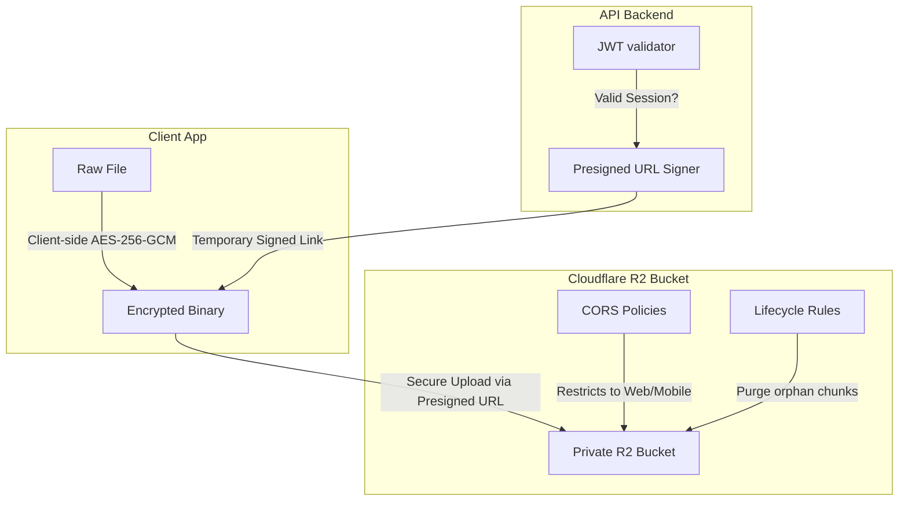
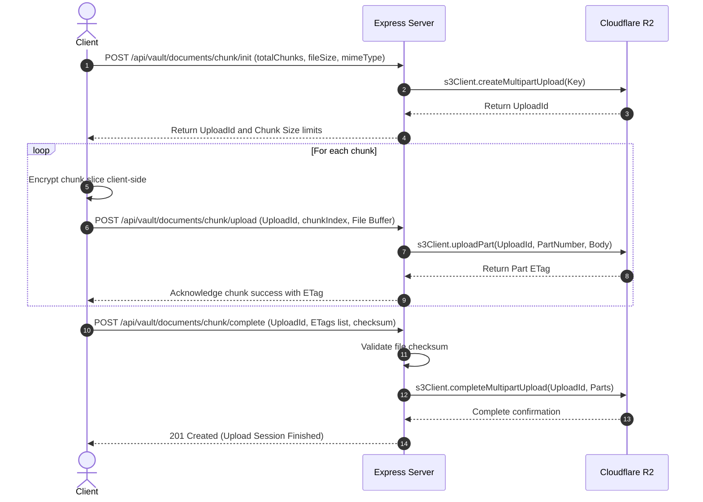
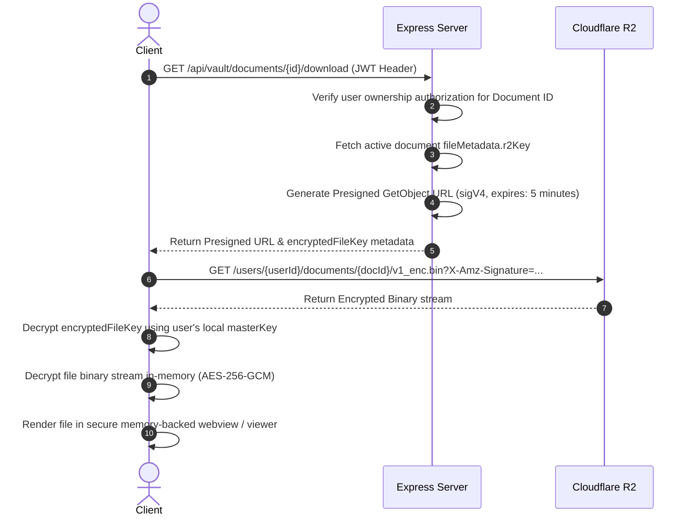
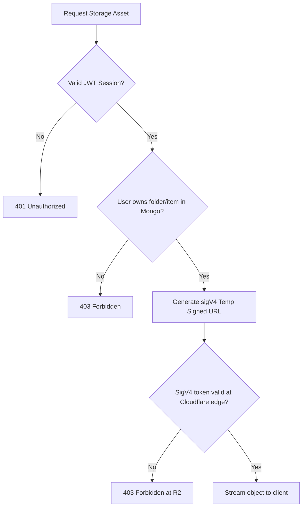

# Cloud Storage Architecture & Disaster Recovery Blueprint - Cloudflare R2

This document details the secure storage architecture for **Personal Vault** using **Cloudflare R2**. The design ensures that binary assets are fully isolated, private-by-default, and encrypted end-to-end, while utilizing S3-compatible chunked upload systems and cost-optimized lifecycle rules.

---

## 1. Storage Architecture

Personal Vault utilizes S3-compatible Cloudflare R2 object storage. Files are never publicly exposed. Access is strictly mediated via authorization services and authenticated presigned link generation.

### 1.1 Bucket Directory Hierarchy
Objects are organized using a user-scoped prefix namespace to enforce strict data isolation boundaries:

```text
r2-personal-vault-bucket/
└── users/
    └── {userId}/                     # MongoDB User ObjectId representation
        ├── documents/
        │   ├── {documentId}/         # MongoDB Document ObjectId
        │   │   ├── v1_enc.bin        # Client-encrypted binary payload
        │   │   ├── v2_enc.bin
        │   │   └── metadata_enc.json # Client-encrypted file metadata envelope
        │   └── thumbnails/
        │       └── {documentId}_t.bin # Encrypted high-performance previews
        └── transient_chunks/
            └── {uploadId}/           # Active chunk upload sessions
                ├── part_0.bin
                ├── part_1.bin
                └── status.json       # Assembly metadata tracking
```

### 1.2 Object Naming Convention
* **Files:** Named using the version index prefix `{version}_enc.bin` (e.g. `v1_enc.bin`, `v2_enc.bin`) to prevent metadata leaks (such as original file names or file extensions) at the storage bucket level.
* **Metadata Envelopes:** Stored client-side encrypted in MongoDB or as a separate encrypted JSON object alongside the document version.

---

## 2. Security Architecture



### 2.1 Private-by-Default Configuration
* **No Public Endpoint:** The R2 bucket is created with public access disabled. No public domain names or DNS records point directly to the storage assets.
* **Access Control:** All operations require signature validation. Client calls are signed using AWS Signature Version 4 (SigV4).

### 2.2 Client-Side Encryption Boundaries
* **Envelope Encryption:** Files are encrypted client-side using a unique, random 256-bit symmetric key (`fileKey`) under the **AES-256-GCM** standard.
* **Server Blindness:** The backend service and Cloudflare R2 receive only ciphertext. If the storage or backend layer is compromised, no documents can be read without the user's master key.

### 2.3 CORS Configuration
Strict Cross-Origin Resource Sharing (CORS) rules prevent unauthorized domain interactions with the R2 endpoints:
```xml
<CORSConfiguration>
  <CORSRule>
    <AllowedOrigin>https://web.personalvault.io</AllowedOrigin>
    <AllowedOrigin>app://mobile.personalvault</AllowedOrigin>
    <AllowedMethod>GET</AllowedMethod>
    <AllowedMethod>PUT</AllowedMethod>
    <AllowedHeader>*</AllowedHeader>
    <ExposeHeader>ETag</ExposeHeader>
    <MaxAgeSeconds>3600</MaxAgeSeconds>
  </CORSRule>
</CORSConfiguration>
```

---

## 3. Upload Flow

For large files, the client segments, encrypts, and uploads files using Cloudflare R2 Multipart upload APIs mediated by the backend server:



---

## 4. Download Flow

To ensure high-performance downloads without bottlenecks on the backend, documents are downloaded directly from R2 using short-lived signed URLs:



---

## 5. Access Control Flow

All storage access permissions are dynamically evaluated on every API request. R2 access is strictly restricted:



---

## 6. Cost Optimization Strategy

Cloudflare R2 charges **zero egress fees**, which significantly lowers operational costs. The cost optimization strategy focused on storage tiering and cleanup:

### 6.1 Lifecycle Policies
* **Orphaned Multipart Upload Cleanup:** Automatically delete incomplete multipart uploads after 7 days to avoid storing orphan chunks.
  ```json
  {
    "Rules": [
      {
        "ID": "AbortIncompleteMultipartUploads",
        "Status": "Enabled",
        "Filter": { "Prefix": "" },
        "AbortIncompleteMultipartUpload": { "DaysAfterInitiation": 7 }
      }
    ]
  }
  ```
* **Trash Retention Policies:** Documents soft-deleted (`isArchived: true`) are kept in MongoDB for 30 days. After 30 days, an automated job triggers database purge and calls R2 `DeleteObject` to remove binaries.

### 6.2 Cache Controls
* Although objects are private, thumbnail requests can leverage Cloudflare CDN caching dynamically:
  * Cache control headers are signed alongside the URL: `Cache-Control: private, max-age=86400` (caches on user's browser/device for 24h, avoiding repeated downloads).

---

## 7. Backup Strategy & Disaster Recovery

### 7.1 Cross-Region Replication (CRR)
* Configure Cloudflare R2 bucket replication rules to mirror data asynchronously to a secondary bucket in a different geographic region (e.g. primary in `weur` - Western Europe, backup in `wnam` - Western North America).
* Enables automatic failover if the primary storage edge suffers a prolonged outage.

### 7.2 Database & Storage Synchronization
* **Point-In-Time Recovery (PITR):** MongoDB Atlas PITR is configured for 7-day windows.
* **Storage Versioning Match:** R2 bucket versioning is enabled. Every change in a document metadata reference matches the exact `versionNumber` tracking key. If a database rollback occurs:
  1. Retrieve the corresponding database snapshot state.
  2. Resolve document model versions to their associated version suffixes (e.g. `v1_enc.bin`) in the backup bucket, restoring complete data alignment.
